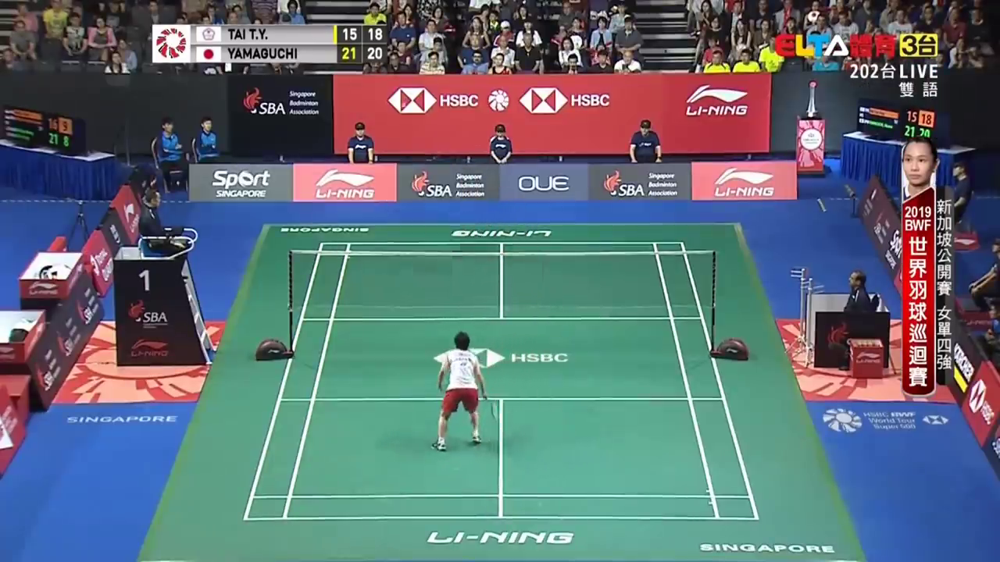

# Video Inpainting using Temporal Relationship of Consecutive Frames 
CSIE7625 Video Communication Final Project.
## Introduction
Remove a certain moving object in the video sequence using temporal information. 

**Limitation**: Fixed Camera, No Overlap Between Dynamic Objects.

### Input Image:

### Inpainted Image:

